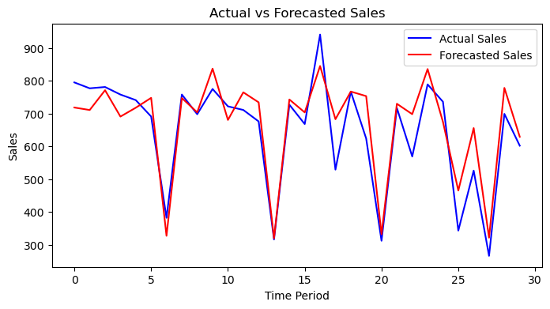
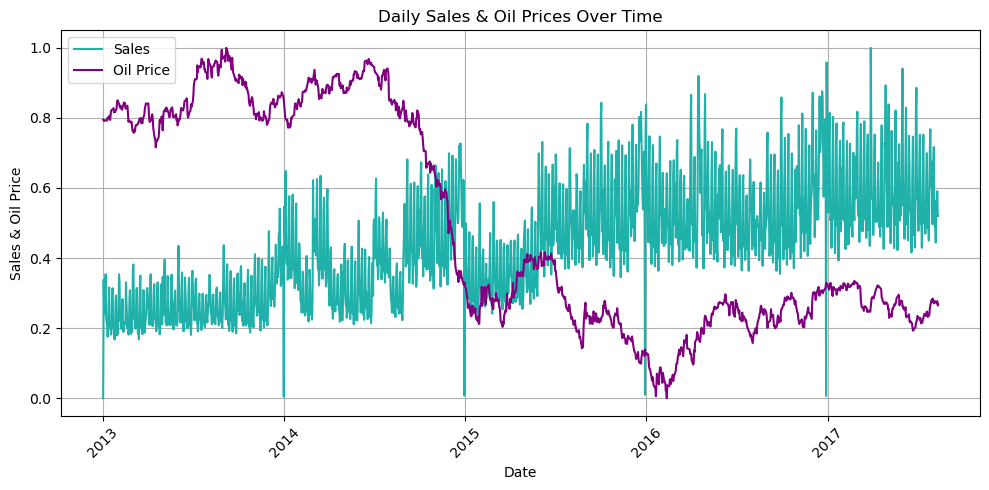
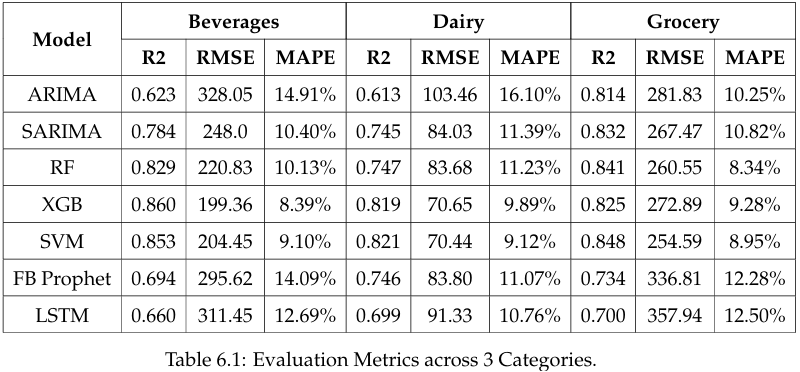

# Retail Sales Time Series Forecasting



## Project Description
This project analyzes and forecasts retail sales using recursive time series forecasting techniques, along with machine learning and deep learning models. The analysis focuses on understanding seasonality, trends, and external factors affecting sales to predict future trends accurately. The project compares various models, including ARIMA, SARIMA, Random Forest, XGBoost, SVM, Facebook Prophet, and LSTM, to identify the best-performing forecasting technique.

## Overview
Accurate sales forecasting is crucial for optimizing inventory, resource allocation, and revenue management in the retail industry. This project investigates the sales data of Corporacion Favorita, an Ecuadorian retailer, over five years. Key objectives include:
1. Performing Exploratory Data Analysis (EDA) and feature engineering to extract meaningful insights.
2. Developing recursive time series forecasting models to predict sales.
3. Comparing traditional, machine learning, and deep learning models to find the optimal forecasting approach.
4. Evaluating the impact of external factors, such as holidays and oil prices, on sales performance.



### Datasets Used
The project integrates the following datasets:
1. **Sales Dataset**: Contains daily sales data for various stores and products.
2. **Stores Dataset**: Includes store-specific attributes like location and type.
3. **Oil Dataset**: Provides daily oil prices, which can impact economic activity and sales.
4. **Holidays Events Dataset**: Lists national and regional holidays/events that influence sales patterns.

### Recursive Time Series Forecasting
The recursive approach is used to predict multiple time steps into the future. In this method:
- A single-step forecast is made for the next time step using available features and past predictions.
- The forecasted value is then fed back as an input for subsequent predictions.
This technique enables the models to forecast future trends iteratively while maintaining accuracy over longer horizons.

## Project Structure
- **Data Preprocessing**:
  - Handled missing values using linear interpolation.
  - Merged datasets to incorporate external features like holidays and oil prices.
  - Encoded categorical variables and normalized data for machine learning models.
- **Feature Engineering**:
  - Created new features, including time-based attributes (day, month, year), holidays, and national holidays.
  - Incorporated oil prices and promotions to improve forecasting accuracy.
- **Model Training**:
  - Developed and tuned ARIMA, SARIMA, Random Forest, XGBoost, SVM, Facebook Prophet, and LSTM models.
  - Implemented recursive forecasting for multi-step predictions.
- **Evaluation**:
  - Assessed model performance using RMSE, R2 score, and MAPE.
  - Compared results to identify the best-performing models.

## Project Files
- **data/df_3_categories.csv**: Filtered dataset used in this project. Contains Corporacion Favorita's sales data, including external features.
- **scripts/Superstore_Sales_Time_Series_Analysis.ipynb**: Jupyter notebook with data preprocessing, model training, and analysis.
- **report/Superstore_Sales_Time_Series_Analysis_Report.pdf**: Detailed project report documenting the methodology, data analysis, model evaluation, and results.
- **README.md**: Project documentation (this file).

## Data Processing Steps
1. **Missing Value Imputation**: Used linear interpolation to handle missing oil price data.
2. **Data Merging**: Combined sales data with supporting datasets (holidays, oil prices, store info).
3. **Feature Engineering**: Created time-based and external features to enhance model performance.
4. **Data Splitting**: Divided data into training (80%) and testing (20%) sets.

## Key Findings
1. **Seasonality and Trends**: Strong seasonal patterns observed in sales data, influenced by holidays and promotions.
2. **Model Performance**:
   - Traditional Models: SARIMA performed well for capturing seasonality.
   - Machine Learning: XGBoost outperformed other models with low RMSE and high R2 score.
   - Deep Learning: LSTM captured long-term dependencies but required careful tuning.
3. **Recursive Forecasting**: Recursive techniques effectively handled multi-step predictions, maintaining accuracy over longer forecast horizons.
4. **External Factors**: Holidays and oil prices significantly impacted sales, highlighting the importance of including these features in forecasting.

## Dependencies
The following Python libraries are required:
- `numpy`
- `pandas`
- `matplotlib`
- `seaborn`
- `statsmodels`
- `sklearn`
- `xgboost`
- `tensorflow`
- `fbprophet`

Install dependencies with:
```bash
pip install -r requirements.txt
```

## Results and Recommendations
- **Best-Performing Models**:
XGBoost and SVM achieved the best accuracy with low RMSE and high R2 scores. SARIMA effectively handled seasonal trends in the data.

- **Insights**:
Promotions and holidays drive sales significantly.
Incorporating external features like oil prices improves model accuracy.

## Conclusion
This project demonstrates the effectiveness of combining recursive forecasting techniques with traditional, machine learning, and deep learning models for retail sales forecasting. The findings provide actionable insights for optimizing inventory and resource planning in the retail industry.

## Contributing
Contributions are welcome! If you find any issues or want to improve the code, feel free to open a pull request or create an issue in the repository.

## License
This project is licensed under the [MIT License](./LICENSE). See the LICENSE file for more details.


For more details, please refer to the [project report](./Superstore_Sales_Time_Series_Analysis_Report.pdf).
